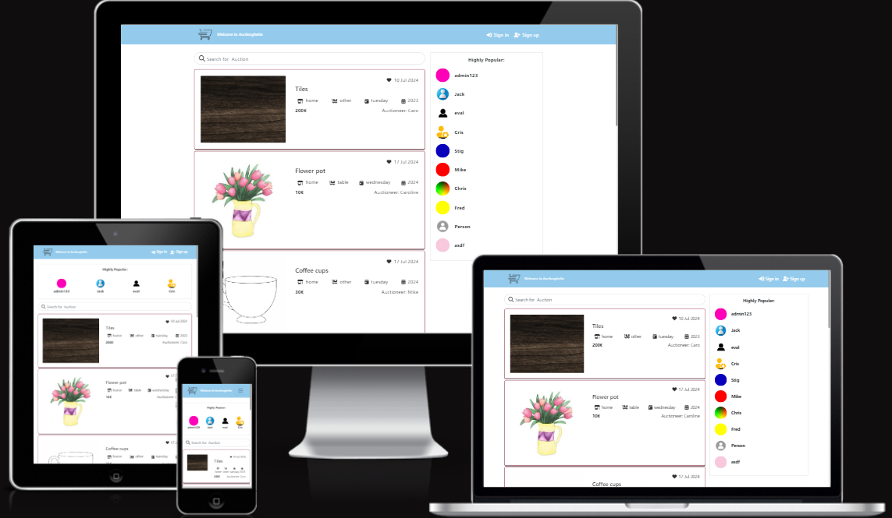

<h1 style="font-size: 45px; text-align: center; color: brown;"> Welcome to Auctiongetto website !</h1>

- 

 
                                           
##  Auctiongetto | Auction website for all materials!

  Auctionghetto is an auction platform where potential users sample and sale their products. Our aim is
  to provide a community friendly platform for both buyers and salers looking to buy or sell their items.

  Following features are available in our site
  In Auctionghetto we offer a user-friendly interface that allows sellers to effortlessly create captivating listings. Our intuitive posting system ensures that sellers can showcase their auctions with compelling descriptions and high-quality images.
  Advanced Search Functionality: Find your choice product with our advanced search filters. You can refine your search based on specific criteria, eg.. product name, categories, year and so on. 

  You can personalize your choice product as a registered user, you can conveniently bookmark your choice product for a revisit. This feature allows you make an informed decision after you might have compared several other items before buying.

 

- Auctionghetto-live app - Click[here](https://auctionghetto-65bba3a96be0.herokuapp.com/).
 
 * Follow this link to view the Backend repository of Auctionghetto project.
 - Auctionghetto backend - Click[here](/https://github.com/Madu-J/auctionghetto-backend/blob/main/README.md).

 

## Table of Contents

 - + [User Experience (UX)](#user-experience-ux)

  - [User Stories](#user-stories)

  - [Design](#design)

+ [Feature](#feature)
     - [Future Features](#future-features)
     - [Bugs](#bugs)
     - [Fixed Bugs](#fixed-bugs)
     - [Remaining Bugs](#remaining-bugs)
- [Technologies Used](#technologies-used)
     - [Languages and Frameworks Used](#languages-and-frameworks-used)
     - [Python Modules Used](#python-modules-used)
     - [Packages Used](#packages-used)
     - [Programs and Tools Used](#programs-and-tools-used)
- [Deployment](#deployment)
    - [Deploying to GitHub](#deploying-to-github)
    - [Deploying with Heroku](#deploying-with-heroku)
- [Credits](#credits)
     - [Credit](#credit)
     - [Media](#media)
    

# User Experience (UX)

- Welcome to Auctionghetto, Auctionghetto is an auction platform where potential user sample and sale their products. Our aim is to provide a community friendly platform for both buyers and salers looking to buy or sell their items.

## Following features are available in our site

- In Auctionghetto we offer a user-friendly interface that allows sellers to effortlessly create captivating listings. Our intuitive posting system ensures that sellers can showcase their auctions with compelling descriptions and high-quality images.

- Advanced Search Functionality: Find your choice product with our advanced search filters. You can refine your search based on specific criteria, eg.. product name, categories, year and so on. 

- You can personalize your choice product as a registered user, you can conveniently bookmark your choice product for a revisit. This feature allows you make an informed decision after you might have compared several other items before buying.

 

# User Stories

 * The user stories are readily available in the GitHub repository, neatly grouped into Epics 
   for enhanced organization. This 
   allows for easy tracking and management of project features. By organizing user stories into Epics, you can get a clear visual representation of the project's progress and understand the high-level goals and themes.
  
 - 

 - To view more User Stories- Click [here](https://github.com/users/Madu-J/projects/14/views/1)

  ## Agile methodology
  - During the project development, I embraced an Agile Methodology, leveraging the powerful capabilities of GitHub Projects to create User Stories.

 

# Design & Color

 - Light blue
 - 

 

 # Design and structure

 - 

 
 

 

# Features

 

 ## Navbar & Search

   The navbar allow users to explore different sections and easily navigate throughout the site pages of the website conveniently. Whether it's accessing specific categories, browsing through listings, or accessing account-related information, the navbar provides a streamlined way to navigate the site.

   When a user opens the auction page, they are required to log in first in order to bookmark their choice product and have the option to follow them. User won't be able to bookmark their own listed products. The navbar dynamically updates its links based on the user's state. For instance, if a user is logged in, they will see related to their account, such as auctioneer, follow, unfollow, and bookmark an item.

   In addition, the navbar incorporates a search bar. This search function enables users to search among the various listings available on the site. By simply entering keywords or specific criteria into the search bar, users can quickly find relevant listings, making their browsing experience more efficient and tailored to their preferences.
   

 

## Auctionghetto Listings

* The auction listing section comprehensively displays a collection of available auctions on trade or to be traded. It serves as a centralized platform for users to browse and explore various auctions that are currently on the market. By aggregating a wide range of auctionghetto listings, it offers convenience and ease of access for potential buyers or interested individuals looking to explore different options.

- Each auctionghetto listing within the platform provides vital information to assist users in making informed decisions. This information typically includes essential details about any auction, such as:

- Provides listing information and key details about a particular auction item and the day of which trade will kick-start. 
The listing also displays the price of the auction, helping users evaluate and offer their own bidding within their budget.

 

## Action Details page

* The auction listing section displays a collection of available auctions on trade or to be traded. It serves as a centralized platform for users to browse and explore various auctions that are currently on the market. By aggregating a wide range of auctionghetto listings, it offers convenience and ease of access for potential buyers or interested individuals looking to explore different options.

Each auctionghetto listing within the platform provides vital information to assist users in making informed decisions. This information typically includes essential details about any auction, such as:

Provides listing information and key details about a particular auction item and the day of which trade will kick-start. 
The listing also displays the price of the auction, helping users evaluate and offer their own bidding within their budget.

 

## Auctions Edit page

* The Auctions Edit page is a dedicated page that allows users to update an existing 
posts, which provides a convenient and user-friendly interface for modifying details information associated with a particular listing.
Updating Auctionghetto Post: On the Auctions Edit page, users can make changes and updates to an existing auction post. This includes modifying various aspects of listing on the website, such as:
- Editable Fields: Users can update fields such as the price of each auction item, description, technical specifications, features, condition, contact information, and any other relevant details associated with the auction.

- Uploading New Images: Users may also have the option to upload new images or replace existing auction item to provide a potential buyer with clearer picture of auction item.

- Correcting Information and saving changes: If there were any inaccuracies or mistakes in the original auctionghetto post, the Auctions Edit page allows users to correct and update the information, ensuring that the listing provides accurate and reliable details.

 

## Auctioneer page

* The (Auctioneer page) a profile page plays a vital role in providing sellers with a valuable opportunity to showcase their company effectively. It serves as a dedicated platform where sellers can present their company in a comprehensive and compelling manner to users.

The auctioneer page allows sellers to create a visually appealing and informative presentation of their product. They can include high-quality images, and to engage users and convey their brand identity effectively.

The auctioneer page serves as a critical component of the platform, enabling sellers to effectively market their auction products and increased visibility and locations for pick up.

 

## Edit Actioneer

* Edit Auctioneer feature has been meticulously designed to facilitate sellers in effortlessly updating their existing information. It offers a user-friendly interface that empowers sellers to make modifications to their profiles with ease, guaranteeing the accuracy and up-to-date information.

* This indispensable functionality enables users to preserve their relevancy in the market by 
consistently presenting the most current and pertinent details about who they are and their products to potential customers.

 

## Feed Page

* The Feed page displays collection of listed auctions, and tailored to the specific preferences of each user. This designed feature presents a comprehensive display of various product listed by the auctioneers s whom the user follows.

* Feed page serves as a convenient and centralized platform for users to stay constantly 
updated with the latest inventory from their preferred sellers. This ensures that users never miss out on exciting auction opportunities and effortlessly provides them with a seamless browsing experience through a personalized selection of items that perfectly align with their unique interests and preference.

 

## Bookmark page

* The Bookmark page serves as a meticulously designed and dedicated space, providing users with a seamless and convenient access point to view all auction they have saved. This feature acts as a personalized collection, offering users a platform to effortlessly keep track of items that have captured their interest or that they intend to revisit later on.

* This page enables users to effortlessly retrieve or review their preferred selections. Also 
allows users to make comparing and considering options, making it easier for them to make informed purchasing decisions.

 

# Future Features

* Payment System: Adding payment feature that will allow users make payment online in a situation where a potential buyer would prefer to pay online via Auctionghetto website.

*Future feature will include bidders app and serializer, this will help enhance user experience, so that auctionghetto user or auctioneer can view the highest bidder.

 

# Technologies Used

* Languages, JavaScript, HTML5 and CSS3

* Frameworks, Libraries & Programs Used

* React - Front-end JavaScript library for building user interfaces based on UI components.

* React Bootstrap - Component-based library that provides native Bootstrap components as pure React components.

* Axios - Promise-based HTTP client for the browser and Node.js. Used to make HTTP requests from throughout the application.

* jwt-decode - Used to decode and extract information from a JWT token.

* react-router-dom - Routing library for the React JavaScript library. Used to display different components based on the URL entered in the browser.

* drawSQL - Tool used to create Database Schema/ERD.

* Git: Version control system used for tracking changes in the source code, with commits and pushes made using the terminal.

* GitHub: Platform used to store the project's code after being pushed from Git.

* The following modules were installed or enabled in Gitpod to assist with formatting and code linting:
* ESLint - A code linter that identifies and reports patterns or coding errors in thecodebase.

* Prettier: An opinionated code formatter that helps maintain consistent code style across the project.

 

# Testing
- Codde underwent Jigsaw validation.
- [W3C Markup Validator](/validator-css/)

 

## Bugs

* Fixed Bugs
- Avatar
- Image - There was issues with images.

 

## Remaining Bugs

- No new bug found.

 

# Deployment

 

* To deploy the project, follow these steps:

*  Forking the GitHub Repository

* Go to the project repository.
- In the top-right corner of the page, click the "Fork" button.
- This will create a copy of the repository in your own GitHub account.
- Running the project locally

* Alternatively, you can use Gitpod:

* Go to the project repository.
- Click on the "Code" button.
- Choose one of the three options (HTTPS, SSH, or GitHub CLI), and click copy.
- Open your IDE program and launch the terminal.
- Type git clone and paste the copied URL from step 3.
- Press Enter, and the local clone of the project will be created.
- Go to the project repository.
- Click the green button that says "Gitpod" to open the project in Gitpod.

* Deploying with Heroku

- To deploy your project using Heroku, follow the steps below based on the Code Institute tutorial:
- In the Gitpod CLI, run the following command to create the necessary files for Heroku to install project dependencies:
- pip3 freeze --local > requirements.txt

- Note: Make sure to add the requirements.txt file to your .gitignore file to prevent it from being committed.
- Visit Heroku.com and log in. If you don't have an account, you will need to create one.

- Click the "New" dropdown and select "Create New App".
- Enter a unique name for your project. Heroku apps require a unique name, and you may be prompted to change it if it's already taken.

* Heroku Deployment

- In the Heroku dashboard, follow these steps:
- Go to the "Deploy" tab.
- Connect your Heroku account to your GitHub Repository by following these steps:
- Click on the "Connect to GitHub" button.
- Enter the name of your GitHub repository and click on "Search".
- Choose the correct repository for your application and click on "Connect".
- Choose your preferred deployment method: manual or automatic.
- Automatic deployment generates a new application every time you push a change to GitHub.
- Manual deployment requires you to push the "Deploy Branch" button whenever you want a change to be made.
- Once you have chosen your deployment method and clicked "Deploy Branch", Heroku will build your application.
- Finally, you should see the "View" button. Click on it to open your deployed application.

 

# Credit

* React Bootstrap documentation and examples
* CodeInstitute tutorial materials and tutors
* Suzan Dewitz - SuzanDewitz/autotraderss
* Google search engine
* SlackOverflow
* Moments walkthrough project
* Antonio Rodriquez - mentor

 

# Images

* pexels.com/photo
* Flaticom
* Icon Packs
* Vecteezy
* Pingterest
* The Noun Project

 
